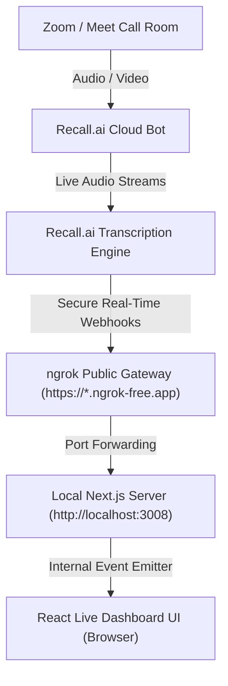

# 🎙️ Meem8 Co-Pilot Hub

Meem8 is a real-time, high-performance meeting intelligence dashboard and AI co-pilot. By integrating **Recall.ai** for cloud bot orchestration, **Ollama** for local AI intelligence, and a secure **ngrok** tunnel, Meem8 joins your video calls (Google Meet, Zoom, MS Teams), streams live diarized transcripts, and serves as an interactive contextual meeting assistant.

---

## 🏗️ Architectural Flow

Here is how transcripts flow dynamically from your live video call into your local dashboard:



---

## 🛠️ Prerequisites

Ensure you have the following installed on your local machine:
- **Node.js** (v18 or higher)
- **Ollama** (running locally with `gemma` or your preferred model)
- **ngrok CLI** (optional, but highly recommended for real-time transcript streaming)

---

## ⚙️ Environment Configuration

1. Create a `.env.local` file in the root of the `meem8` directory:
   ```bash
   touch .env.local
   ```
2. Populate it with your configurations:
   ```env
   # Your Recall.ai workspace API token
   RECALL_API_KEY=your_recall_api_key_here
   ```

---

## 🚀 Step-by-Step Setup Guide

Follow these steps to launch your local meeting co-pilot hub:

### 1. Retrieve your Recall.ai API Key
- Go to [Recall.ai](https://www.recall.ai/) and sign up or log in.
- Navigate to your dashboard, generate an **API Token**, and paste it into your `.env.local` file under `RECALL_API_KEY`.

### 2. Launch the ngrok Secure Gateway (Recommended)
Because Recall.ai runs in the cloud, it cannot send real-time transcript webhooks directly to `http://localhost`. We use ngrok to expose your local port securely.
- Open a dedicated terminal window and run:
  ```bash
  npm run tunnel
  ```
- This launches a secure tunnel forwarding traffic on port `3008`. You can check the tunnel status locally at [http://127.0.0.1:4040](http://127.0.0.1:4040).
- *Note: Our backend features automatic ngrok discovery. Once this tunnel is running, Meem8 will automatically discover the secure URL and register it with Recall on the fly!*

### 3. Start the Next.js Web Dashboard
- In a separate terminal window, start the local development server:
  ```bash
  npm run dev
  ```
- Your web application will now be running at [http://localhost:3008](http://localhost:3008).

### 4. Configure Recall.ai Global Webhooks (Fallback Mode)
If you want transcripts to flow even when ngrok is restarted or offline:
- Copy your active ngrok HTTPS address (e.g. `https://xxxx.ngrok-free.app`).
- Go to the **Recall.ai Dashboard** under **Developer Settings** > **Webhooks**.
- Add a new webhook subscription:
  - **URL**: `https://your-active-ngrok-subdomain.ngrok-free.app/api/webhook/recall`
  - **Events**: Subscribe to `transcript.data` (or all transcript events).

---

## 🎙️ Using the Meeting Dashboard

1. Open [http://localhost:3008/dashboard](http://localhost:3008/dashboard) in your browser.
2. Ensure the **Ollama Diagnostic Badge** in the sidebar shows **Ollama Online**.
3. Paste a valid video meeting URL (e.g. a Google Meet, Zoom invite, or Teams link) into the invitation input card in the live transcript panel.
4. Click **Invite Bot**.
5. Watch the dashboard:
   - The status badge will transition to **Connecting** while Recall dispatches the bot.
   - Once the bot enters the meeting, the badge will glow emerald and display **Recall Active**.
   - As speakers talk, diarized live transcripts will stream in real-time right into your feed!
6. Use the chat sidebar to ask the local Ollama LLM questions about the active meeting conversation in real-time.

---

## 🛠️ Troubleshooting

- **Error: "Failed to dispatch Recall bot"**:
  - Check that your `.env.local` contains a valid API key.
  - Recall blocks insecure `localhost` endpoints. Ensure `npm run tunnel` is actively running *before* sending the invitation.
- **Transcripts are not appearing**:
  - Verify that ngrok is running and that its status panel shows active requests hitting `/api/webhook/recall`.
  - In your Recall dashboard, verify that the bot's media streams are successfully connecting to the meeting room.
