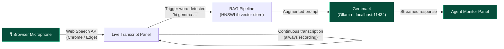
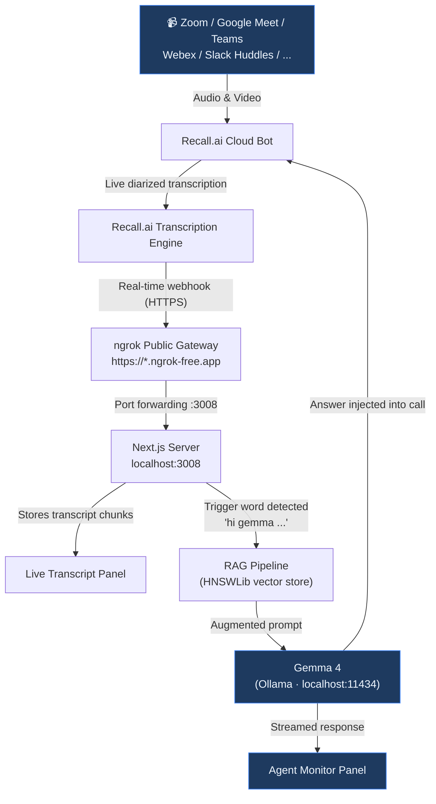

# Meem8 — Your AI Co-Pilot for Every Meeting

Meem8 is a local-first, dual-mode meeting intelligence dashboard. It listens to your calls, transcribes in real time, and puts **Gemma 4** on standby — activated only when you say the trigger word. No continuous cloud inference. No passive surveillance. Just answers when you need them.

It works with **every major video conferencing platform**: Zoom, Google Meet, Microsoft Teams, Webex, Slack Huddles, and any platform supported by Recall.ai.

---

## Dual-Mode Architecture

Meem8 ships with two operating modes. You choose based on what the meeting demands.

| | Air-Gapped Local | Cloud Bot |
|---|---|---|
| **How it works** | Browser mic → Gemma 4 on your machine | Recall.ai bot joins the call remotely |
| **Data leaves device?** | Never | Transcripts processed locally; bot audio via Recall.ai |
| **Best for** | Legal, HR, board, NDA, executive calls | Standups, demos, all-hands, retrospectives |
| **Requires** | Ollama + Chrome/Edge | Recall.ai API key + ngrok |
| **Default?** | Yes | Toggle in dashboard |

---

## Architecture

### Mode A — Air-Gapped Local (Default)

Zero bytes leave your device. The browser's Web Speech API captures your microphone directly and streams the transcript into the dashboard. Gemma 4 activates only when the trigger word is spoken.



### Mode B — Cloud Bot

A Recall.ai bot joins the call on your behalf. Transcripts are pushed to your local server via webhook, triggering the same Gemma 4 engine.



---

## Prerequisites

**Both modes require:**
- Node.js v18+
- Ollama with `gemma4:latest` pulled

**Local Mode additionally requires:**
- Chrome or Edge (Web Speech API is not supported in Firefox or Safari)

**Cloud Bot Mode additionally requires:**
- A [Recall.ai](https://www.recall.ai/) API key
- ngrok CLI

---

## Installation

```bash
git clone https://github.com/tianchengc/meem8.git
cd meem8
npm install
```

---

## Environment Configuration

Create a `.env.local` file in the project root:

```bash
touch .env.local
```

```env
# Required for Cloud Bot Mode only
RECALL_API_KEY=your_recall_api_key_here
```

Local Mode requires no API keys — it runs entirely offline.

---

## Setup Guide — Air-Gapped Local Mode

The fastest path to a running co-pilot. No API keys, no tunnels, no external services.

### Step 1 — Pull Gemma 4

```bash
ollama run gemma4:latest
```

Wait for the model to download and confirm it loads. You can quit the interactive session (`/bye`) — Ollama will keep the model available as a server.

### Step 2 — Start the Dashboard

```bash
npm run dev
```

Open [http://localhost:3008/dashboard](http://localhost:3008/dashboard) in **Chrome or Edge**.

### Step 3 — Verify Ollama Status

In the right panel → **Control Panel** tab, the **Ollama Status** section should show **Gemma 4 (Local) Ready**. If it shows **Ollama Offline**, ensure Ollama is running. If it shows **Model Missing**, re-run Step 1.

### Step 4 — Start the Microphone

The dashboard opens in **Air-Gapped Local Mode** by default (green shield indicator). In the left panel, click **Start Local Secure Microphone** and grant browser microphone permission when prompted.

### Step 5 — Use the Trigger Word

Speak normally. The transcript panel records everything continuously. To invoke Gemma 4, say your trigger word followed by your question:

> *"hi gemma, what was the decision on the Q3 deadline?"*

The answer streams into the center **Agent Monitor** panel. Your configured trigger word is editable in the Control Panel sidebar.

---

## Setup Guide — Cloud Bot Mode

The bot joins any supported meeting platform on your behalf. No host permissions or screen sharing required.

### Step 1 — Pull Gemma 4

```bash
ollama run gemma4:latest
```

### Step 2 — Add Your Recall.ai API Key

Sign up at [recall.ai](https://www.recall.ai/), generate an API token, and add it to `.env.local`:

```env
RECALL_API_KEY=your_recall_api_key_here
```

### Step 3 — Start the ngrok Tunnel

In a dedicated terminal window:

```bash
npm run tunnel
```

This exposes `localhost:3008` over a public HTTPS URL. Meem8 auto-discovers the active ngrok URL and registers it with Recall.ai when you invite a bot.

> Verify the tunnel is active at [http://127.0.0.1:4040](http://127.0.0.1:4040).

### Step 4 — Start the Dashboard

In a separate terminal:

```bash
npm run dev
```

Open [http://localhost:3008/dashboard](http://localhost:3008/dashboard).

### Step 5 — Switch to Cloud Bot Mode

Click the **Cloud Bot** toggle in the dashboard header. The panel will transition to the cloud-ready state (blue indicator).

### Step 6 — Invite the Bot to Your Meeting

1. Copy your meeting URL (Zoom, Google Meet, Teams, Webex, etc.)
2. Paste it into the URL input in the left panel
3. Click **Invite Bot**

The status badge transitions: **Connecting** → **Recall Active**. Live diarized transcripts begin streaming within seconds of the bot entering the call.

### Step 7 — Use the Trigger Word

Say the trigger word during the meeting:

> *"hi gemma, can you summarise what we've agreed so far?"*

Gemma 4 processes the query with full meeting context and streams the answer into your Agent Monitor. In Cloud Bot Mode, the response is also injected directly into the meeting chat for all participants to see.

### (Optional) Step 8 — Configure a Global Webhook Fallback

If ngrok restarts and you want transcripts to resume automatically, register the webhook URL permanently in the Recall.ai dashboard:

- Go to **Developer Settings → Webhooks**
- Add: `https://your-ngrok-subdomain.ngrok-free.app/api/webhook/recall`
- Subscribe to `transcript.data` events

---

## Supported Meeting Platforms

Both modes support any platform you can access from your browser. Cloud Bot Mode specifically supports all platforms in Recall.ai's bot roster:

| Platform | Local Mode | Cloud Bot Mode |
|---|---|---|
| Google Meet | ✅ | ✅ |
| Zoom | ✅ | ✅ |
| Microsoft Teams | ✅ | ✅ |
| Webex | ✅ | ✅ |
| Slack Huddles | ✅ | ✅ |
| Any browser-based call | ✅ | Recall.ai dependent |

In Local Mode, Meem8 captures audio from whatever is playing through your microphone input — it is platform-agnostic by design.

---

## Trigger Word Configuration

The default trigger word is `hi gemma`. To change it:

1. Open the dashboard → right panel → **Control Panel**
2. Edit the **Trigger Word** field
3. Click **Save**

The new trigger word takes effect immediately for both modes.

---

## Dashboard Layout

```
┌─────────────────────────────────────────────────────────────────────┐
│  MEEM8 logo          [ Air-Gapped Local | Cloud Bot ]               │  ← Header
├──────────────────┬──────────────────────────┬───────────────────────┤
│                  │                          │                       │
│  Live Transcript │    Agent Monitor         │   Workspace Sidebar   │
│                  │                          │                       │
│  · Mic control   │  · Conversation history  │  · Ollama status      │
│  · Live captions │  · Streaming responses   │  · Trigger word       │
│  · Interim text  │  · Source badges         │  · Setup guide        │
│                  │    (Local / Cloud /       │  · Knowledge base     │
│                  │     Dashboard)           │                       │
│                  │  · Copy response button  │                       │
│                  │  · Manual prompt input   │                       │
└──────────────────┴──────────────────────────┴───────────────────────┘
```

---

## Troubleshooting

**"Gemma 4 Unavailable" in Agent Monitor**
- Ensure Ollama is running: `ollama serve`
- Confirm the model is pulled: `ollama list` should show `gemma4:latest`

**"Model Not Found" in Ollama Status**
- Pull the model: `ollama run gemma4:latest`

**Microphone button does nothing (Local Mode)**
- You must use Chrome or Edge — Firefox and Safari do not support the Web Speech API
- Check that your browser has microphone permission for `localhost`

**"Failed to dispatch Recall bot" (Cloud Bot Mode)**
- Verify `RECALL_API_KEY` in `.env.local` is valid
- Ensure `npm run tunnel` is running before inviting the bot — Recall.ai cannot reach `localhost` directly

**Transcripts not appearing (Cloud Bot Mode)**
- Open [http://127.0.0.1:4040](http://127.0.0.1:4040) and verify ngrok is forwarding requests to `/api/webhook/recall`
- Check the Recall.ai dashboard to confirm the bot successfully joined the meeting room

**Gemma 4 not responding to trigger word**
- Confirm the trigger word in the Control Panel sidebar matches what you're saying
- In Cloud Bot Mode, the trigger is detected server-side from the webhook transcript — ensure the bot is in the call and transcripts are streaming
